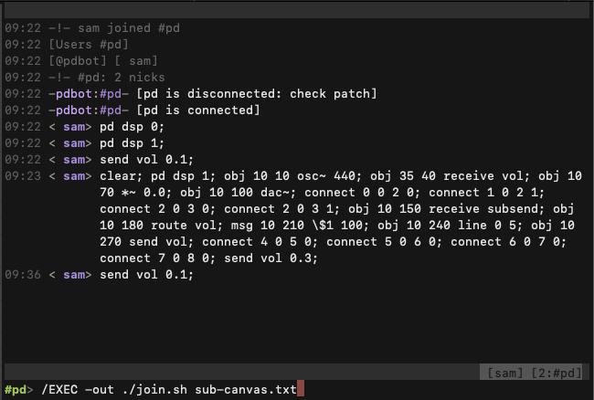

<!--
Copyright (c) 2022 Sam Blenny
SPDX-License-Identifier: CC-BY-NC-SA-4.0
-->

---
title: '2022-07-14: Music with Markab + IRC + Pd'
link: 'https://samblenny.github.io/markab-dev-journal/2022-07-14.html'
published: '2022-07-14T08:47:00Z'
updated: '2022-07-14T08:47:00Z'
author: 'Sam Blenny'
copyright: 'Copyright (c) 2022 Sam Blenny'
---

## A new quest begins

A friend asked me the other day what I plan to do next with Markab. That
question got me thinking and inspired what's starting to look like a bit of a
quest.

I've decided I want to be able to write Markab code to build and operate synth
patches in Pure Data (pd "vanilla"). Also, I want to be able to control that
process with irc chat as the primary user interface. The idea is that training
a band of silly robots to play music would probably be fun and also have a fair
possibility of translating well to video.

So far, I've written an irc bot to connect a Pure Data (pd "vanilla") patch to a
private irc channel that I'm hosting from a server on my desk.

This is what it looks like using irc to send Pd messages with instructions to
modify its patch with a tone generator (41KB png):

This is what the pd patch looks like (14KB png):

## Links

These are links to the raw files (no js) related to pdbot.

- [pdbot irc bot](https://raw.githubusercontent.com/samblenny/markab-lab/2022-07-14/pdbridge/pdbridge.py)
  written in Python to bridge between irc and Pd's network protocol.
- [Pd patch](https://raw.githubusercontent.com/samblenny/markab-lab/2022-07-14/pdbridge/net-rxtx.pd)
  that listens for a connection from pdbot.
- [shell script](https://raw.githubusercontent.com/samblenny/markab-lab/2022-07-14/pdbridge/join.sh)
  that I use with irssi to filter newlines out of a file of Pd messages so I can
  send them all at once without rate limiting by the irc server.
- [text file](https://raw.githubusercontent.com/samblenny/markab-lab/2022-07-14/pdbridge/sub-canvas.txt)
  with messages to tell Pd how to clear its subcanvas and then re-create its
  tone generator with a volume control receiver.

